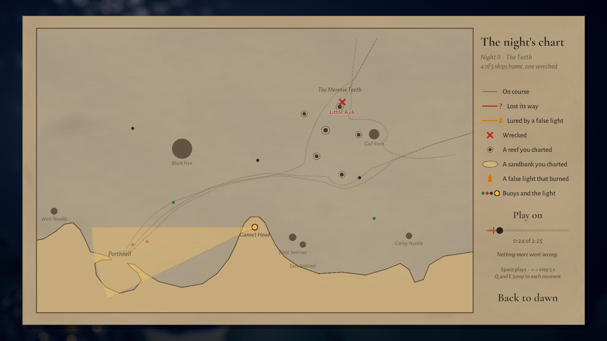
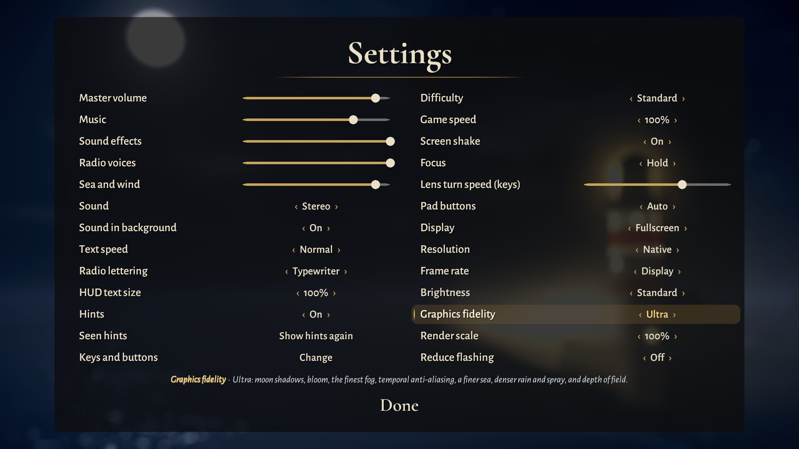

<p align="center">
  
</p>

<h1 align="center">Last Light</h1>

<p align="center">
  <em>You keep the last lighthouse on a wrecking coast. Sweep its beam through the night to guide ships home,<br>
  chart the hidden reefs ahead of them, and expose the false lights trying to lure them in.</em>
</p>

<p align="center">
  
  
  
  
  
  
</p>

<p align="center">
  <a href="docs/media/LastLight_trailer.mp4"><b>Watch the trailer</b></a> ·
  <a href="https://nearbycoder.github.io/LastLight/"><b>Play in your browser</b></a> ·
  <a href="#play-it"><b>Download</b></a> ·
  <a href="#how-to-play">How to play</a> ·
  <a href="#settings-and-accessibility">Settings</a> ·
  <a href="#build-from-source">Build from source</a>
</p>

## Play in your browser

**[Play Last Light in your browser](https://nearbycoder.github.io/LastLight/)**: no download or
install, built from `main` (the same game as the screenshots and trailer below).

- **Browsers:** a desktop browser with WebGL 2 and a keyboard and mouse, or a gamepad. Checked in
  headless Chromium 151 and Firefox 157 on Linux (AMD Radeon 8060S); not yet
  tried in Safari, on Windows or macOS, or by a person at a real screen. Phones and tablets
  can load it, but the game has no touch controls.
- **Download:** about 26 MB the first time (19 MB of it is the game's data);
  the browser keeps a copy for later visits. The title was up 2 to 4 s after opening the page from
  a local server (load average about 20 on a busy 32-core machine); over the internet, add the
  time 26 MB takes to arrive.
- **Saves and settings** stay in the browser's storage for this site (IndexedDB) and survive a
  reload, but not clearing the site's data or a private window. They aren't shared with the
  desktop game or with other browsers.
- **What differs from the desktop game:** sound starts after your first click or key press (a
  browser rule); there's no Quit (close the tab); Settings ▸ Display asks the browser for
  fullscreen (or Alt+Enter; Esc leaves it) and there's no Resolution row, since the page fills the
  window; new saves start on Graphics fidelity **Medium** rather than High, because WebGL costs
  more than the desktop renderer (the setting still offers Low to Ultra; Night I on High ran at
  53 to 58 fps in headless Chromium and Firefox here, against a 60 fps ceiling); Mono folds the browser's sound output to one
  channel, which was set but not heard through speakers. A night left mid-way by closing the tab
  is treated like a crash: a Night Watch is kept as it stood at its last checkpoint.

## Trailer

[](docs/media/LastLight_trailer.mp4)

<sub>1 minute 50 seconds, 1920×1080, with the game's own music and sound and no narration. Every
shot is the game running on Graphics fidelity Ultra, recorded from scripted nights (see
<a href="#the-trailer">how the trailer is made</a>).</sub>

## About

Gannet Head Light is being switched off at the end of the season. A radio beacon will replace it.
You have twelve nights left.

Out on Merrow Bay, trawlers, coal steamers and the passenger ferry steer by your light. Keep a
ship in the beam and its captain sails on with confidence. Leave it in the dark and the captain
loses the way, drifting toward rocks nobody can see. There's one beam and there are many ships,
so every night is a quiet juggling act. The sea looks calm, but every decision is tense.

Each night adds one new idea: hidden reefs, buoys, fog, damaged ships with no lights, storms, and
wreckers on the cliffs with lanterns that imitate yours. Nights take two to five minutes and are
rated with up to three lamps, so a night you nearly kept is always worth one more try. Finish the
season and an endless **Night Watch** opens.

Every model was built by script in Blender, and every sound, radio voice and note of music was
synthesized in Python. The game uses no stock or sampled assets.

## Play it

1. Download `LastLight-v0.1.0-linux-x86_64.zip` from the
   [latest release](https://github.com/nearbycoder/LastLight/releases/latest).
2. Unzip it and run `./LastLight.sh`, or run `./LastLight.x86_64` directly.

> **The download is older than this page.** v0.1.0 was published on 4 October 2026. Twelve rounds
> of improvements have landed on `main` since (the dawn debrief and chart, breakers warnings, Hard
> difficulty, Graphics fidelity with Ultra, names on the water, the keeper's notes, rebindable keys
> and pad buttons, mono sound and much more; see [`docs/IMPROVEMENTS.md`](docs/IMPROVEMENTS.md)),
> and no release has been cut from them yet. This README, its screenshots and the trailer show
> `main`. To play that version, [build it from source](#build-from-source).

**System requirements.** 64-bit Linux and a GPU with OpenGL 4.5. The game was developed on CachyOS
(Arch) with an AMD Radeon 8060S integrated GPU under KDE Wayland, where night V (fog, the costly
night) ran at about 150 fps on Low and 70 fps on Ultra at 1600×900 (see
[Graphics fidelity](#graphics-fidelity)). On Wayland, `LastLight.sh` starts Unity's native Wayland
backend, because the X11/XWayland path hung at startup on the development machine. There's no
published Windows or macOS build (see [Status and known issues](#status-and-known-issues)).

Progress and settings are saved in `save.json` in the game's data folder (on Linux
`~/.config/unity3d/Gannet Head/Last Light/`).

## How to play

Point the light. That's the whole interface. The rest is deciding where to point it.

| Action | Mouse and keyboard | Gamepad |
|---|---|---|
| Aim the beam | Move the mouse (the lens follows with weight), or turn it with **A / D** or **← / →** | Right or left stick |
| Focus: a narrow, long, bright beam that turns slower | Hold the **left mouse button**, **Shift**, **W** or **↑** (or press to switch, with Focus set to Toggle) | Hold either trigger (or press, with Toggle) |
| Sound the foghorn (14 s cooldown) | **Space** or the **right mouse button** | **A** |
| Pause, or back out of a menu | **Esc** or **P** | **Start** (and **B** in menus) |
| Move through and choose menu items | Mouse, or **arrow keys / Tab** and **Enter** | D-pad or stick, **A** to choose |
| Switch between a window and fullscreen | **F11** or **Alt+Enter** | |

The keyboard keys for turning, focus and the foghorn, and the gamepad's buttons for focus and the
foghorn, can be changed in **Settings ▸ Keys and buttons** (three keys each, two buttons each; Esc,
P and Start always pause, and F11 switches fullscreen). A pad player who aims with the right stick
can put the foghorn on a shoulder button, so the thumb stays on the aim. The mouse buttons keep
theirs, either stick turns the light, and every prompt names the keys and buttons you've chosen.
The pad's buttons are named as an Xbox pad's above; **Settings ▸ Pad buttons** gives every prompt
PlayStation names (Cross, Circle, R2, Options) or Nintendo's (B, A, ZR, +, by position, so the
bottom button is B), and on *Auto* the game guesses from the pad's name. There's no touch input.

Hints, the title's control strip, the briefing prompt and the HUD's foghorn key follow the device
you last touched, so a gamepad player reads "Hold RT" and "A" rather than mouse buttons and Space.
Each hint shows once per save (**Settings ▸ Show hints again** brings them back). The pause menu
shows the controls for the device you're using, and **Keeper's notes**, on the title menu and in
the pause menu (the night waits), keep the rules in short entries that open as the season reaches
each idea.

### The rules in brief

- **Ships follow the light.** Each ship has a confidence ring. It refills in your beam and drains
  in the dark. At zero the captain is **Lost**: the ship slows, wanders and drifts toward the shore
  until you light it again. A lost ship shows a red ring and a bobbing **?**. A lured ship shows an
  amber ring, a small **lantern** and a dashed tether to the false light that has it, so the two
  read apart by shape as well as colour. The ship icons in the top bar carry the same marks (a
  **?** or a lantern), with a **cross** once a ship is wrecked and a **tick** once it's home.
- **Reefs are hidden.** Captains' routes run straight over rocks they can't see. Light a reef
  briefly to **chart** it. White water breaks over it and captains steer around it. A chart fades
  about 22 seconds after the light leaves it, so time your sweeps to stay just ahead of each ship.
- **Breakers ahead.** A few seconds before a ship reaches an uncharted reef (or a steamer an
  uncharted sandbank), its crew hear the surf. Its ring flickers white, a pale ring pulses round
  it and the captain may call out. If you chart the rock too close for the captain to turn, they
  ring for **full astern**, with three short blasts, and the ship slows hard while it swings
  clear. A chart in the last moment can still be a near miss.
- **Wrecks end nights.** A night ends when every scheduled ship has made port or been lost, and
  fails at once if the wrecks exceed that night's allowance: one wreck on most nights, two on
  nights 8, 10, 11 and 12. The briefing says how many, and hulls under the night's title count
  them down, ending on "next wreck ends the night".
- **Three lamps.** You earn a lamp for keeping the light through the night, a second for losing
  no ship, and a third for a **steady hand**: no ship ever Lost or Lured. The three lamps under the
  score go out as they're lost, with a note naming the ship, so you can see what's still in play.

## Features

### A beam with weight


The lens is a heavy mass on a damped spring. It builds up speed, overshoots slightly and settles,
and the shaft cuts through moonlit haze, lighting the swell. **Hold to focus** for a narrow, long
beam that reaches the far lanes and pierces fog, at the cost of a slower, smaller sweep.

**Names on the water.** When a ship is on the radio, or a call names one ("before the Auk gets
there"), its name shows under its hull for the length of the call. A call that names a place you
can see (a buoy such as the Hen Bell, a wreckers' cliff, a sea stack or Porthkell harbour) labels
it on the water for a few seconds, and a reef group or sandbank gets its name the first time it's
charted each night. A hidden hazard is never pointed at before it's charted. Names out of frame
stay at the screen's edge with a chevron, and names step aside rather than cover each other or a
ship's mark.

### Chart the hidden reefs


The Merrow Teeth, Widow's Ledge and the Long Sands lie right across the captains' routes. Sweep
the water ahead of a ship and the surf breaks white over each reef you reveal, and the captain
steers around it. Steamers turn wide and need warning early, while trawlers can dodge late.

### Buoys, fog and the foghorn


A sweep lights a channel buoy, and a burning buoy keeps nearby ships steady for about 28 seconds
while you tend to others. Sea fret rolls in on later nights: fog drains ships faster and swallows
the wide beam. Focus punches through it, and the **foghorn** sends a shockwave across the water
that steadies every ship in earshot.

### Ships running dark, and storms


**Damaged vessels** carry no lights. Find them from their radio bearing and the red distress
flares they send up. **Storms** push ships off course with a current and shorten your beam, but
every lightning strike lights the whole bay and charts every reef for a moment.

### Wreckers and false lights


The Corleys sweep lanterns from the cliffs that imitate your light. A ship caught in a false beam
while you're elsewhere is **Lured** toward the rocks. Hold your beam on the lantern to douse it,
or light the ship to break the spell. On night 11, one false light copies your every sweep. Two of
the lanterns, Corley Cove and West Point, sit just past the edges of a 16:9 screen; while one burns
there, a lantern marker at the edge points to it, and a lured ship out of frame keeps its mark on
screen the same way.

### Every ship counts


Miss a reef and the hull strikes, burns and sinks, and the crew's lifeboat drifts clear. The
captains talk you through it all on the radio. Ianto the harbourmaster, cheeky Maren on the
*Little Auk*, gruff Captain Pryce on the *SS Calloway* and Dot on the ferry *Evening Star* all
grumble, joke, panic and thank you in typed text over synthesized gibberish voices. The pause
menu keeps the night's latest calls, so one you missed can be read again.

### Dawn: the debrief, the chart and the replay
 

Dawn tallies every night with up to three lamps, says where the score came from ("6 ships home 750
· 6 steady hands +300"; a ship that ran dark counts double), and gives a short debrief of every
ship that had a bad night: which reef it struck and whether that reef was uncharted or charted too
late, who was lured and by which false light, and who lost their way. **Chart** opens the night's
chart, Merrow Bay drawn on paper with every ship's track: solid while the captain was on course,
dotted red with a **?** where they lost their way, dashed amber with a lantern where a false light
had them, and a cross at each wreck. **Replay the night** plays it back on the chart, with your
light's sweep, the false lights while they burned and each wreck as it happens. Drag the timeline,
step it with ← and →, play or pause with **Space**, and jump to just before each moment that went
wrong with **E** and **Q** (the pad's d-pad, X and shoulder buttons do the same).

On a night you've kept before, "BEST 880" sits under the score during the night, and turns to
"PAST YOUR BEST" the moment you pass it. If the same night fails twice running, the dawn card
points to Settings ▸ Game speed (or Difficulty, on Hard); it changes nothing by itself.

### Twelve nights, and the Night Watch
 

The keeper's logbook keeps your best for each night so you can go back for a cleaner watch, and a
kept night's briefing says which lamp is still to earn. **Start a new season** in the logbook
clears the nights, lamps, scores and watch records (it asks first, and keeps your settings and
keys). Finish the season and the **Night Watch** opens: an endless score attack with every reef,
sandbank and buoy out and no end to the ships. Each watch brings its own weather: one to three fog
banks in different places, squalls that blow through every few minutes with current, rain and
lightning (stronger as the night wears on), and wreckers lighting up at their own times, with the
mimic light late in a long watch. Ianto gives the forecast in the briefing, the third wreck ends
the watch, and the game keeps your five best. To stop, choose **End the watch** in the pause menu:
the watch is kept and ranked. Closing the game during a watch keeps it the same way, and if the
game is cut off without closing (a crash, a power cut), the next start keeps the watch as it stood
at its last checkpoint, taken every 20 seconds.

## Settings and accessibility



A line under Settings says what the chosen row does, and a soft brass band marks the row you're
on, whether you got there with the mouse, the keys or a pad. Behind Settings, the pause card, the
keeper's notes, the logbook, dawn and the chart, the bay softens so the words read clearly (on Low
it's only dimmed).

| Group | Settings |
|---|---|
| Sound | Volumes for master, music, effects, radio voices, and sea and wind; **Sound**: Stereo or **Mono** (every sound in both ears alike, for hearing on one side or a single speaker); **Sound in background** (off: silent while the window is out of focus) |
| Reading | **Text speed**; **Radio lettering**: the worn typewriter or **Plain** letters, on the HUD, in briefings and in the pause menu's log; **HUD text size** 100, 115 or 130% (the radio, hints, manifest, score, foghorn and markers; menus keep their size); hints on or off, and show hints again |
| Controls | **Keys and buttons** (see [How to play](#how-to-play)); **Focus**: hold or toggle; **Lens turn speed** for the keys; **Pad buttons**: Auto, Xbox, PlayStation or Nintendo names |
| Challenge | **Difficulty**: Standard or Hard; **Game speed** 100, 85 or 70%; **Screen shake** |
| Display | Windowed or fullscreen; resolution; **Frame rate**: the display's rate, or a cap of 60 or 30 to save power and heat; **Brightness**: five steps for the 3D scene, from half a stop darker to a stop brighter (menus and HUD unchanged); **Graphics fidelity** (below); **Render scale** 100, 85, 70 or 50% while the text stays sharp; **Reduce flashing**: the storm's lightning lights the bay at about a tenth of its strength |

**Game speed** is an assist that slows the whole night together: ships, the lens, fog, storms and
wreckers. Only you gain time. Music, the radio's typing and the menus keep their pace, and the dawn
card and the table of best watches say when a night or watch was slowed.

**Hard** makes ships lose heart about 30% faster, a chart fades after 15 seconds instead of 22, a
lit buoy burns 20 seconds instead of 28, the crew give no breakers warning, and Night Watch ships
come about 15% closer together. It takes effect from the next night; records are shared, and the
dawn card, the HUD and the table of best watches say when it was Hard.

A night pauses itself when the game window loses focus or the gamepad you're using is unplugged.
Restarting, leaving or opening the logbook from the pause menu asks first, with **Stay** selected.
Menus and the HUD fit screens of other shapes (checked at 16:10, 5:4 and 21:9 as well as 16:9), and
on screens narrower than 16:9 the camera widens its view so the whole bay stays in sight. Press
Esc, Start or B during the ending and a second press skips to the title.

### Graphics fidelity

One setting covers everything about the picture that costs. **High** is the default and the game
as released. After a night that ran well short of the frame rate it aims for (below 45 frames a
second), the dawn card says so and names the next settings to lower (Graphics fidelity, then
Render scale, then a 30 fps cap).

| Step | What it does | Night V while playing* |
|---|---|---|
| **Low** | For a weaker GPU: fog and haze raymarched in 10 steps, FXAA, half the particles (rain, spray, smoke, wakes); menus dim the bay rather than blur it | 6.7 ms (about 150 fps) |
| **Medium** | 16 raymarch steps, SMAA Medium, three quarters of the particles | 8.0 ms (about 125 fps) |
| **High** (default) | As released: 24 raymarch steps, SMAA High, all the particles | 9.3 ms (about 107 fps) |
| **Ultra** | Soft moon shadows (the tower down the headland, the sea stacks and rocks across the water, the harbour); light shafts smoothed by temporal anti-aliasing over a 40-step raymarch with a finer octave of fog; finer ripples on the sea; 1.6× the rain and spray; bloom on the lantern and the lamps; and on the title the far bay and the sky soften behind the tower | 14.3 ms (about 70 fps) |

<sub>*Median frame time on the development machine's Radeon 8060S at 1600×900, frame rate uncapped,
render scale 100%, three rounds through the steps (the full table, with the title and night XII,
is in <a href="docs/IMPROVEMENTS.md#round-12-results-2026-10-08">docs/IMPROVEMENTS.md</a>).</sub>

## Content overview

One coast (Merrow Bay), three hulls and twelve nights. Each night introduces one idea through
night 9, and the later nights combine them:

| Night | Name | What's new |
|---|---|---|
| I | First Watch | Aiming: ships follow the light |
| II | The Teeth | Hidden reefs and charting, and focus for reach |
| III | Lantern Row | Buoys |
| IV | Deep Water | Collier steamers and the Long Sands shoal |
| V | Sea Fret | Fog banks and the foghorn |
| VI | The Evening Star | The passenger ferry |
| VII | Mayday | Damaged vessels without lights |
| VIII | Squall | Storm current, rain and lightning |
| IX | False Light | Wreckers |
| X | Two Lights | Wreckers moving between sites, in fog |
| XI | The Mimic | A false light that copies your sweep |
| XII | Last Light | The finale |
| ∞ | Night Watch | Unlocked after the season: endless, with every hazard out and its own fog, squalls and wreckers each time; the third wreck ends the watch |

| Hull | Character |
|---|---|
| Trawler | Small and quick, turns tightly, loses confidence fast |
| Collier steamer | Big and slow, turns wide, runs aground on sandbanks that trawlers sail over |
| Passenger ferry | Rows of lit windows, and worth the most |

Around the nights you'll find a live title scene, briefing cards, the radio, pause and settings
menus, the keeper's notes, dawn results with the night's chart, an ending, and credits that name
every ship you brought home. If the save can't be read, the title says so and where the damaged
copy was kept (`save.unreadable.json`); if it can't be written (a full disk, a read-only folder),
the dawn card and the title say progress isn't being kept. A save that's there but can't be
opened is never written over.

## Screenshots

All taken from the game on Graphics fidelity Ultra at 1920×1080.

| | |
|---|---|
|  |  |
|  |  |
|  |  |
|  |  |
|  |  |
|  |  |

## Build from source

**Requirements:** Unity **6000.6.2f1** (URP 17.6, Input System 1.20; the packages resolve from
`Packages/manifest.json`), **Blender 4.5 LTS** for the models, Python 3 with the packages in
`Tools/requirements.txt` for audio and tooling, and FFmpeg for captures and the trailer.

```sh
python3 -m venv Tools/.venv && Tools/.venv/bin/pip install -r Tools/requirements.txt

# Data: the map and the missions (JSON, the single source of truth for positions)
python3 ArtSource/map/merrow_bay.py
python3 ArtSource/map/missions.py
Tools/.venv/bin/python Tools/chart.py                    # a top-down chart PNG for review

# Models: FBX into Assets/Resources/Models, preview renders into ArtSource/_renders
blender -b --threads 4 -P ArtSource/blender/build_assets.py -- --preview
blender -b --threads 4 -P ArtSource/blender/build_assets.py -- steamer lighthouse   # just some

# Audio: effects, radio voices and music, synthesized to Assets/Resources/Audio
Tools/.venv/bin/python ArtSource/audio/build_audio.py
Tools/.venv/bin/python ArtSource/audio/build_audio.py music                        # just the music

# Unity
Tools/unity.sh                 # open the editor
Tools/unity.sh build-linux     # batch-build Builds/Linux/LastLight.x86_64
Tools/unity.sh build-mac       # batch-build Builds/Mac/LastLight.app (universal Intel + Apple Silicon)
Tools/unity.sh build-windows   # batch-build Builds/Windows/LastLight.exe (needs the Windows module)
Tools/play.sh                  # run the build (LL_W=1920 LL_H=1080 for a window size)
Tools/package.sh 0.1.0 linux   # zip a build for a release, into Builds/release (or mac, windows)
Tools/build-pages.sh           # the browser build: the static site in Builds/Pages/LastLight (Unity's Web module)
node Tools/check-pages.mjs --serve --play --browser=chromium,firefox   # try it as Pages serves it (needs playwright-core)
node Tools/check-pages.mjs https://nearbycoder.github.io/LastLight/      # does the live site reach the title?
```

`Tools/unity.sh` expects the editor at `~/Unity/Hub/Editor/6000.6.2f1` (set `UNITY` to change
that). On Arch-based distributions the editor needs the legacy `libxml2.so.2`
(`sudo pacman -S libxml2-legacy`). Alternatively, set `LASTLIGHT_UNITY_LIBS` to a folder that
contains a copy of it.

### Tests and validation

- `Tools/unity.sh test` runs the EditMode tests (124 of them). They prove the content (every
  mission references valid map data, every reef, buoy and wrecker lantern is reachable by the
  beam, every route is safe for every hull once its hazards are charted), and that the
  **AutoKeeper** bot wins all twelve nights in the pure simulation on Standard and on Hard, keeps
  a generated Night Watch for at least ten minutes, and scores exactly the tuned Standard scores.
  Others cover breakers warnings and full astern, the dawn debrief and the score's parts, Night
  Watch variety and squalls, the radio log, standing a watch down, key and pad-button bindings and
  their save format, pad button names, names on the water and the label placer, the keeper's
  notes, the night's log and the dawn chart's replay (the light within 1.5°, every ship within a
  unit), the save file (new season, damaged, unopenable or unwritable saves, a watch cut short),
  the frame-rate advice and Graphics fidelity. Tests that touch a save write only under the
  project's `Temp/` folder.
- `Tools/validate.sh` prints the same checks as a report from a resident editor
  (`Tools/unity.sh serve`). `Tools/tour.sh report <dir>` produces the report from the built player.
  It also plays every night with a **novice keeper**, which is slow to react, has a shaky hand and
  doesn't know where the reefs are. The report was last run in round 2; the simulation's balance
  hasn't changed since (a test pins the AutoKeeper's Standard scores). Then the AutoKeeper won all
  twelve nights with three lamps each, and the novice won every night in three runs each with 93
  of 108 lamps and no wrecks; both kept every generated Night Watch for the full 30 minutes the
  report runs. On **Hard** the AutoKeeper still won all twelve nights, and the novice dropped to 74
  of 108 lamps with 7 wrecks, close to v0.1.0's 78 and 9.
- `Tools/tour.sh <script> <dir> -llFresh` plays the built game with scripted input, checks what it
  sees and saves screenshots. Give `<dir>` as an absolute path. `-llFresh` keeps the tour away from
  your save, and tours use a config directory of their own (`Builds/tour-config`, or
  `LL_TOUR_CONFIG`). The scripts are `ui`, `nights`, `ending`, `input`, `watch`, `flash`,
  `breakers`, `status`, `radiolog`, `screens`, `watchend`, `endingskip`, `speed`, `offscreen`,
  `confirm`, `brightness`, `keys`, `names`, `notes`, `framerate`, `chart`, `lamps`, `best`, `help`,
  `perf`, `padkeys`, `mono`, `lettering`, `fullscreen` and `fidelity`; what each checks is in
  `Assets/Scripts/Automation/` and in [`docs/IMPROVEMENTS.md`](docs/IMPROVEMENTS.md).
  `-llRenderScale 70`, `-llReduceFlashing`, `-llHard`, `-llHudScale 130` and `-llFidelity 0`–`3`
  set those options for any tour.
- `Tools/season_tour.sh <reset|damaged|migrate|readonly|unopenable|quitwatch|termwatch|quitnight|killwatch|closewatch> <dir>`
  runs the `season` tour, which uses a real save, against a throwaway config directory under
  `<dir>`.
- `Tools/nested.sh <command>` runs a tour (or the game) inside a private, invisible KWin with its
  own D-Bus session and config folders, so test windows never appear on the desktop you're using:
  `Tools/nested.sh Tools/tour.sh chart "$PWD/Builds/out" -llFresh`. It needs `kwin_wayland`, and it
  stops the helpers its session started when it ends.
- `Tools/.venv/bin/python Tools/cvd_sim.py OUT.jpg "Label=shot.png:x,y,w,h" ...` shows screenshot
  crops as seen with deuteranopia and protanopia, for checking that states read without colour.
- `Tools/.venv/bin/python Tools/audio_check.py` measures every synthesized clip: clipping, true
  peak, EBU R128 loudness, DC offset, clicks, and the seams of looped clips.
- `Tools/record.sh` records a four-minute gameplay reel with sound.

### The trailer

`Tools/make_trailer.sh` rebuilds the trailer, its poster, the teaser loop and the screenshots in
`docs/media` from the built game, shooting inside `Tools/nested.sh` when `kwin_wayland` is there.
It shoots on Graphics fidelity Ultra (`LL_FIDELITY` picks another step) into `Captures/` (or
`LL_CAPTURES`). The `trailer` tour (`Assets/Scripts/Automation/Trailer.cs`) plays each shot as a
scripted night. The AutoKeeper does the playing, with a little staging: a neglected trawler, a
forced foghorn, a held focus. The simulation is deterministic, so a headless twin of each night
runs first to find the frame where the moment happens. The real night is then fast-forwarded off
camera and recorded at a fixed 30 fps (each frame takes as long as it needs, so Ultra costs only
time), with the game's audio mix and music muted. `Tools/make_trailer.py` cuts the clips to the
bars of the title waltz, which it re-synthesizes from the game's own music generator. It also
animates the captions in the game's fonts, ducks the music under the game's sound, normalizes to
−16 LUFS and encodes the trailer, the poster and the teaser loop. `Tools/make_trailer.sh --edit`
re-edits an existing shoot.

## Project structure

```
Assets/
  Scripts/Sim/         Pure C# simulation: map, beam, ships, reefs, buoys, fog, wreckers, storm,
                       scoring, the Night Watch generator, the AutoKeeper bot, content validation
  Scripts/View/        World, ship and effect views, camera rig, materials, model loading, fidelity
  Scripts/Core/        Game flow, mission runner, input, radio, save data, the night's log, the ending
  Scripts/UI/          HUD and menu screens, the dawn chart, built in code
  Scripts/Audio/       Pooled SFX buses and the layered music director
  Scripts/Automation/  Screenshot tours, the gameplay recorder and the trailer shoot
  Shaders/             Water, volumetric atmosphere, sky, lit props, glows, rings, reef foam
  Resources/Data/      merrow_bay.json (the map) and missions.json (the twelve nights)
  Resources/Models/    FBX exported from Blender
  Resources/Audio/     Synthesized OGG effects, voices and music
  Resources/Fonts/     Cormorant Garamond, Alegreya Sans, Special Elite, with their licenses
  Editor/              Project setup, build script, import settings
  Tests/EditMode/      Content proofs and the rest (see Tests and validation)
ArtSource/
  blender/             bpy model generators (build_assets.py is the entry point) and .blend scenes
  audio/               numpy/scipy synthesis of effects, voices and music
  map/                 merrow_bay.py and missions.py, which write the JSON data
Tools/                 Editor, build, play, tour, validation, chart, audio-check and trailer scripts
docs/                  BRIEF.md (the original brief), PLAN.md (the design and technical plan),
                       IMPROVEMENTS.md (twelve rounds of improvements since v0.1.0), media/
```

## Tech highlights

- **A simulation you can prove things about.** All gameplay lives in a pure C# `SimWorld`,
  stepped at a fixed 60 Hz with a seeded RNG. The view layer only reads it and interpolates. The
  same code runs in the game, in the EditMode tests and under the AutoKeeper bot, which plays
  through the same input struct as a player, so the lens's speed limits apply to it too.
- **What looks lit is lit.** The beam test (cone falloff, range, the shadows of sea stacks and fog
  extinction) is written once in C# and mirrored in HLSL (`LLCommon.hlsl`). The glow you see on
  the water is the same function the ships respond to.
- **Volumetric night.** A full-screen raymarch (`Atmosphere.shader`) computes single scattering
  from the beam analytically per sample, together with moonlit haze and drifting fog banks.
  Graphics fidelity sets the step count, and on Ultra a per-frame dither lets temporal
  anti-aliasing smooth the shafts. Water uses Gerstner waves, a moon glitter path, and a foam
  texture the simulation writes for charted reefs and wakes.
- **One source of truth for the coast.** `merrow_bay.json` drives the simulation and Blender's
  generators for the cliffs, rocks and buoys, so geometry and gameplay can't drift apart. The
  generators can render a preview of each model for review (`--preview`).
- **Synthesized sound.** Radio voices are formant-synthesis gibberish, pitched and timed per
  character and band-passed like a wireless. The score (a waltz, a night bed with a tension layer
  that rises as ships get lost, dawn, and a music-box ending) comes from the same Python
  generators, and a measurement pass guards against clicks, loop seams and loudness drift.
- **Balance by bot.** The AutoKeeper wins every night, and a deliberately sloppy novice model gives
  a rough difficulty curve across the season.

## Credits and tooling

Made by [nearbycoder](https://github.com/nearbycoder). The original brief, the design plan and the
improvement rounds are in [`docs/BRIEF.md`](docs/BRIEF.md), [`docs/PLAN.md`](docs/PLAN.md) and
[`docs/IMPROVEMENTS.md`](docs/IMPROVEMENTS.md).

- **Engine:** Unity 6000.6.2f1 with the Universal Render Pipeline and the Input System.
- **Models:** generated with Blender 4.5's Python API (`ArtSource/blender`).
- **Sound and music:** synthesized with numpy and scipy (`ArtSource/audio`).
- **Fonts:** [Cormorant Garamond](https://github.com/CatharsisFonts/Cormorant) and
  [Alegreya Sans](https://github.com/huertatipografica/Alegreya-Sans) under the SIL Open Font
  License 1.1, and Special Elite by Astigmatic under the Apache License 2.0.
- **Trailer and captures:** FFmpeg, numpy and Pillow.

See [`THIRD_PARTY_NOTICES.md`](THIRD_PARTY_NOTICES.md) for the full list of third-party
components and their licenses.

## Status and known issues

The game is complete: twelve nights, the ending and the Night Watch, on Linux. The published
release is still v0.1.0 (4 October 2026); everything since is on `main` only (see
[Play it](#play-it)). Here's what is still unproven or rough:

- **Not yet playtested by a person.** Balance comes from the AutoKeeper and the novice model, and
  feel was judged from screenshots, video and scripted input. The same goes for the later
  additions: names on the water, the keeper's notes, the lamps at stake, the dawn chart and its
  replay (6× a night's speed), the score to beat, the offer of help after two failures, Plain
  lettering, and the descriptions in Settings.
- **Standard may now be too forgiving.** After v0.1.0, captains learned to ring for full astern
  when a charted reef is closer than they can turn away from, which removed most of the wrecks the
  bot and the novice model suffered. Both now keep every Standard Night Watch for 30 minutes.
  **Hard** (Settings ▸ Difficulty) gives roughly v0.1.0's challenge and leaves Standard exactly as
  it was; whether Standard should be tightened is an open decision.
- **The audio has only been measured.** Every clip passes `Tools/audio_check.py`, and Mono was
  measured on the game's own output, but no one has yet judged whether the music and gibberish
  voices are pleasant to listen to.
- **Gamepads were tested only as simulated devices.** Button layouts, stick dead zones, rebound
  buttons and Auto's guess at PlayStation and Nintendo pads (which names Unity reports for them on
  Linux is unknown, and Steam Input usually presents every pad as an Xbox one) are unverified on
  real controllers. There's no rumble. Key names come from the keyboard layout, but only a US
  layout has been tried.
- **Linux only, as published.** `Tools/unity.sh build-mac` makes a universal macOS app (Mono, macOS
  12 or later) and `Tools/package.sh <version> mac` zips it with instructions for opening an
  unsigned app, but it isn't signed with a Developer ID or notarized, and **it has never been run
  on a Mac**. `build-windows` is ready but needs Unity's *Windows Build Support (Mono)* module,
  which isn't installed on the development machine. The browser build (see
  [Play in your browser](#play-in-your-browser)) was checked in headless Chromium and Firefox on
  Linux only. The save's location and
  its trouble notices were checked on Linux only.
- **Graphics fidelity was measured on one machine, with its GPU shared.** Whether Low is smooth on
  a genuinely weak GPU, and how Ultra runs on a discrete card, hasn't been tried. Ultra's temporal
  anti-aliasing was checked for smearing in captures of a playing night, not by a person watching
  the beam swing.
- **Post-processing that never reached a build before round 12.** Bloom, ACES tonemapping, film
  grain, chromatic aberration and depth of field were set up in code but showed only in the editor
  (URP strips every post effect that no profile asset in the project uses). High keeps that look;
  Ultra now has bloom, and depth of field softens the bay behind menus. Tonemapping, grain and
  chromatic aberration stay off; whether the game should have them is an art call.
- On the development machine, the X11/XWayland window path hung at startup. Use `LastLight.sh`
  under Wayland.
- **Screen shapes were checked in windows, on one machine.** The `screens` tour passes at
  1280×800, 1280×1024, 1600×900 and 2560×1080 windows on KDE Wayland. Fullscreen at those shapes,
  real 4:3 or 16:10 monitors, and a Steam Deck haven't been tried. West Point's false light and the
  rock it lures ships onto sit just past the left edge of the frame at 16:9 and narrower (Corley
  Cove's lantern just past the right); a marker at the edge points to a burning lantern there, but
  a lured ship still wrecks a little off screen. The `ui` tour's switch from one window size to
  another failed now and then in rounds 4 and 8 (the window was resized, then back), cause
  unknown.
- **Fullscreen from the desktop isn't noticed.** F11, Alt+Enter and Settings ▸ Display switch the
  window and are kept. But when the desktop itself makes the window fullscreen (KWin's own shortcut
  or window menu), Unity's Wayland backend goes on reporting a window, so Settings still says
  Windowed and the next start goes back to a window. Only KDE's KWin on Wayland was tried.
- **Game speed shares records.** A night kept at 70% counts in the logbook like any other, and only
  the dawn card and the watch table mark it.
- **Frame rates were measured on one machine.** The caps measured 120, 60 and 30 fps on a 120 Hz
  screen; battery and heat savings on a real laptop or handheld haven't been measured, and whether
  45 fps is the right line for the dawn card's advice needs a playtest on a weak laptop.
- **The save moved after v0.1.0.** The v0.1.0 Linux player kept its save in
  `~/.config/unity3d/unknown/unknown/prefs`, a file every Unity player with the same fault shares.
  The save is now `save.json` in the game's own data folder, written to a temporary file and
  swapped in whole, and the first launch of a newer build carries an older save over. A save that
  can't be read is kept as `save.unreadable.json`, and "Start a new season" keeps the season it
  clears as `save.previous.json`; neither can be restored from inside the game, only by renaming
  the file. A full disk wasn't tried.
- **A watch cut short keeps up to its last 20 seconds.** Closing during a Night Watch keeps it
  (checked with the game's own quit, SIGTERM and KWin's close request). If the game is killed
  instead (SIGKILL in the test, standing in for a crash), the next start keeps the watch as it
  stood at its last checkpoint. A real crash and a power cut weren't tried.
- **Names step aside, but only a line or two.** On a crowded spot (two wrecks at the same rock on
  the chart) the names stack up beside each other; when no clear place is near, a name takes the
  least covered one.
- **No license has been chosen yet.** Until one is added, all rights are reserved. The bundled
  fonts keep their own open licenses.
