<p align="center">
  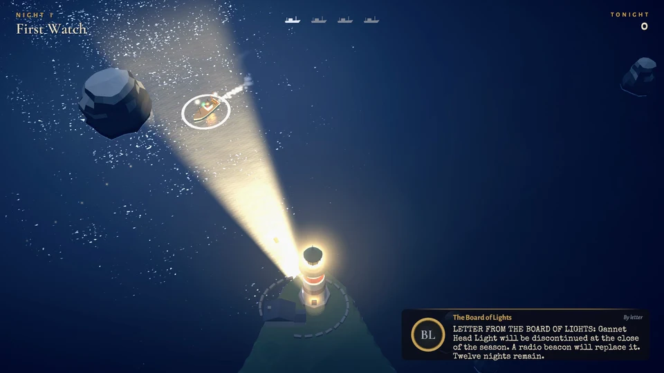
</p>

<h1 align="center">Last Light</h1>

<p align="center">
  <em>You keep the last lighthouse on a wrecking coast. Sweep its beam through the night to guide ships home,<br>
  chart the hidden reefs ahead of them, and expose the false lights trying to lure them in.</em>
</p>

<p align="center">
  
  
  
  
  
  
</p>

<p align="center">
  <a href="https://github.com/nearbycoder/LastLight/releases/latest"><b>Download for Linux</b></a> ·
  <a href="docs/media/LastLight_trailer.mp4"><b>Watch the trailer</b></a> ·
  <a href="#how-to-play">How to play</a> ·
  <a href="#build-from-source">Build from source</a>
</p>

## Trailer

[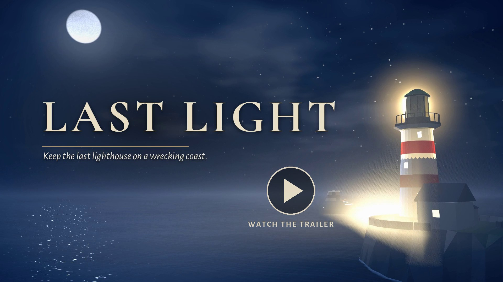](docs/media/LastLight_trailer.mp4)

<sub>1 minute 50 seconds, 1920×1080, with the game's own music and sound. Every shot is the game
running, recorded from scripted nights (see <a href="#the-trailer">how the trailer is made</a>).</sub>

## About

Gannet Head Light is being switched off at the end of the season. A radio beacon will replace it.
You have twelve nights left.

Out on Merrow Bay, trawlers, coal steamers and the passenger ferry steer by your light. Keep a
ship in the beam and its captain sails on with confidence. Leave it in the dark and the captain
loses the way, drifting toward rocks nobody can see. There's one beam and there are many ships,
so every night is a quiet juggling act. The sea looks calm, but every decision is tense.

Each night adds one new idea: hidden reefs, buoys, fog, damaged ships with no lights, storms, and
wreckers on the cliffs with lanterns that imitate yours. Nights take two to five minutes and are
rated with up to three lamps, so a night you nearly kept is always worth one more try. Finish the
season and an endless **Night Watch** opens.

Every model was built by script in Blender, and every sound, radio voice and note of music was
synthesized in Python. The game uses no stock or sampled assets.

## How to play

Point the light. That's the whole interface. The rest is deciding where to point it.

| Action | Mouse and keyboard | Gamepad |
|---|---|---|
| Aim the beam | Move the mouse (the lens follows with weight), or turn it with **A / D** or **← / →** | Right or left stick |
| Focus: a narrow, long, bright beam that turns slower | Hold the **left mouse button**, **Shift**, **W** or **↑** | Hold either trigger |
| Sound the foghorn (14 s cooldown) | **Space** or the **right mouse button** | **A** |
| Pause, or back out of a menu | **Esc** or **P** | **Start** (and **B** in menus) |
| Move through and choose menu items | Mouse, or **arrow keys / Tab** and **Enter** | D-pad or stick, **A** to choose |

The game starts fullscreen. Settings has volumes for master, music, effects, radio and ambience,
along with text speed, hints, screen shake, lens turn speed, windowed or fullscreen, resolution,
fog quality, **render scale** (the 3D scene at 100, 85, 70 or 50% while the text stays sharp)
and **reduce flashing** (the storm's lightning lights the bay at about a tenth of its strength).
A night pauses itself when the game window loses focus or the gamepad you're using is unplugged.

**Difficulty** is Standard (the game as tuned) or **Hard**. On Hard, ships lose heart about 30%
faster, a chart fades after 15 seconds instead of 22, a lit buoy burns 20 seconds instead of 28,
the crew give no breakers warning, and Night Watch ships come about 15% closer together. The
change takes effect from the next night. Records are shared, and the dawn card, the HUD and the
table of best watches say when it was Hard.

Each onboarding hint shows once per save (**Settings ▸ Show hints again** brings them back).
Hints, the title's control strip, the briefing prompt and the HUD's foghorn key follow the device
you last touched, so a gamepad player reads "Hold RT" and "A" rather than mouse buttons and Space.

### The rules in brief

- **Ships follow the light.** Each ship has a confidence ring. It refills in your beam and drains
  in the dark. At zero the captain is **Lost**: the ship slows, wanders and drifts toward the shore
  until you light it again. A lost ship shows a red ring and a bobbing **?**. A lured ship shows an
  amber ring, a small **lantern** and a dashed tether to the false light that has it, so the two
  read apart by shape as well as colour.
- **Reefs are hidden.** Captains' routes run straight over rocks they can't see. Light a reef
  briefly to **chart** it. White water breaks over it and captains steer around it. A chart fades
  about 22 seconds after the light leaves it, so time your sweeps to stay just ahead of each ship.
- **Breakers ahead.** A few seconds before a ship reaches an uncharted reef (or a steamer an
  uncharted sandbank), its crew hear the surf. Its ring flickers white, a pale ring pulses round
  it and the captain may call out. If you chart the rock too close for the captain to turn, they
  ring for **full astern**, with three short blasts, and the ship slows hard while it swings
  clear. A chart in the last moment can still be a near miss.
- A night ends when every scheduled ship has made port or been lost, and fails at once if the wrecks
  exceed that night's allowance. You earn a lamp for keeping the light through the night, a second
  for losing no ship, and a third for a **steady hand**: no ship ever Lost or Lured.

## Features

### A beam with weight
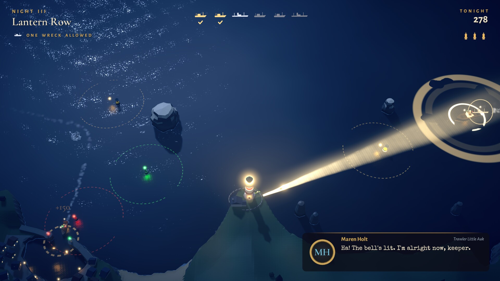

The lens is a heavy mass on a damped spring. It builds up speed, overshoots slightly and settles,
and the shaft cuts through moonlit haze, lighting the swell. **Hold to focus** for a narrow, long
beam that reaches the far lanes and pierces fog, at the cost of a slower, smaller sweep.

### Chart the hidden reefs
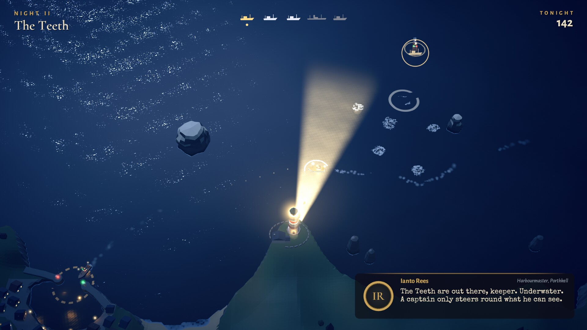

The Merrow Teeth, Widow's Ledge and the Long Sands lie right across the captains' routes. Sweep
the water ahead of a ship and the surf breaks white over each reef you reveal, and the captain
steers around it. Steamers turn wide and need warning early, while trawlers can dodge late.

### Buoys, fog and the foghorn
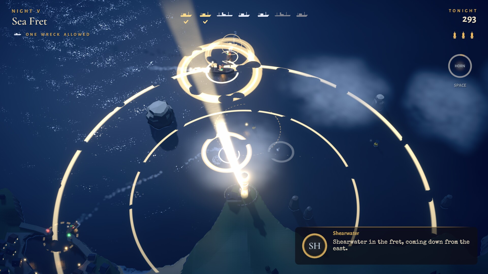

A sweep lights a channel buoy, and a burning buoy keeps nearby ships steady for about 28 seconds
while you tend to others. Sea fret rolls in on later nights: fog drains ships faster and swallows
the wide beam. Focus punches through it, and the **foghorn** sends a shockwave across the water
that steadies every ship in earshot.

### Ships running dark, and storms
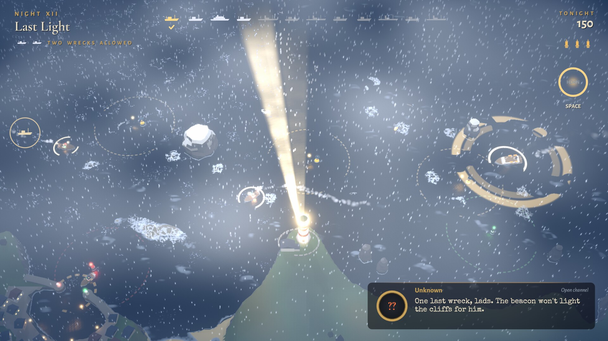

**Damaged vessels** carry no lights. Find them from their radio bearing and the red distress
flares they send up. **Storms** push ships off course with a current and shorten your beam, but
every lightning strike lights the whole bay and charts every reef for a moment.

### Wreckers and false lights
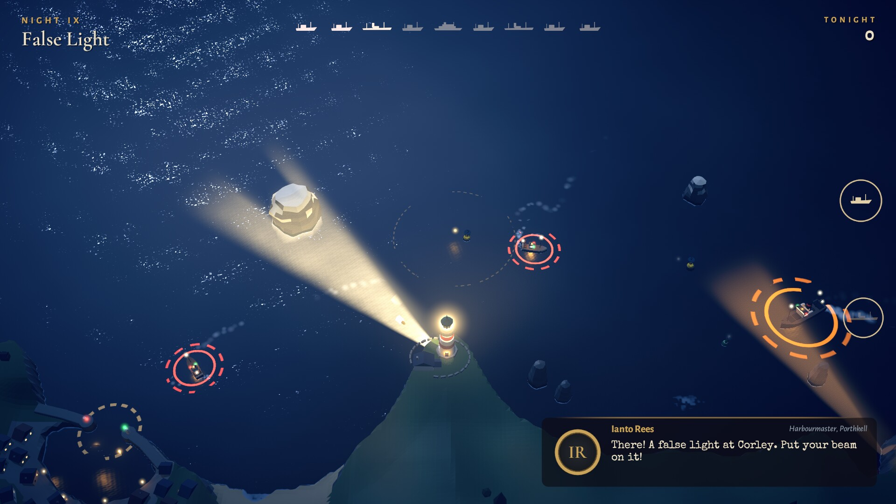

The Corleys sweep lanterns from the cliffs that imitate your light. A ship caught in a false beam
while you're elsewhere is **Lured** toward the rocks. Hold your beam on the lantern to douse it,
or light the ship to break the spell. On night 11, one false light copies your every sweep.

### Every ship counts
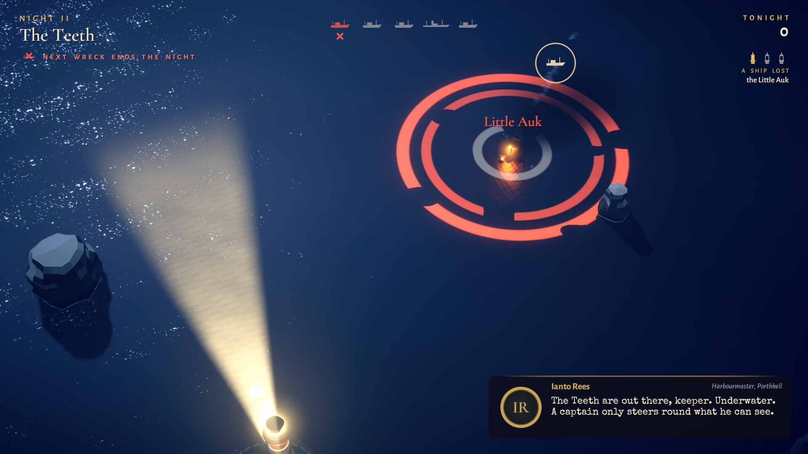

Miss a reef and the hull strikes, burns and sinks, and the crew's lifeboat drifts clear. The
captains talk you through it all on the radio. Ianto the harbourmaster, cheeky Maren on the
*Little Auk*, gruff Captain Pryce on the *SS Calloway* and Dot on the ferry *Evening Star* all
grumble, joke, panic and thank you in typed text over synthesized gibberish voices.

### Twelve nights, three lamps each, and the Night Watch
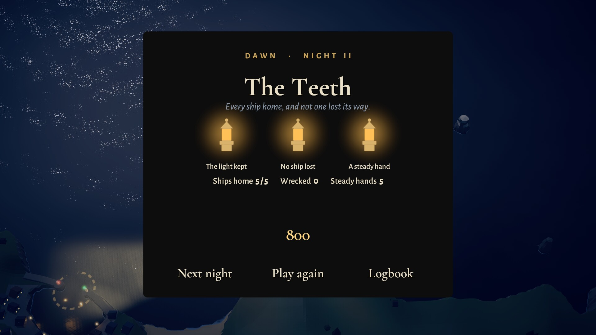 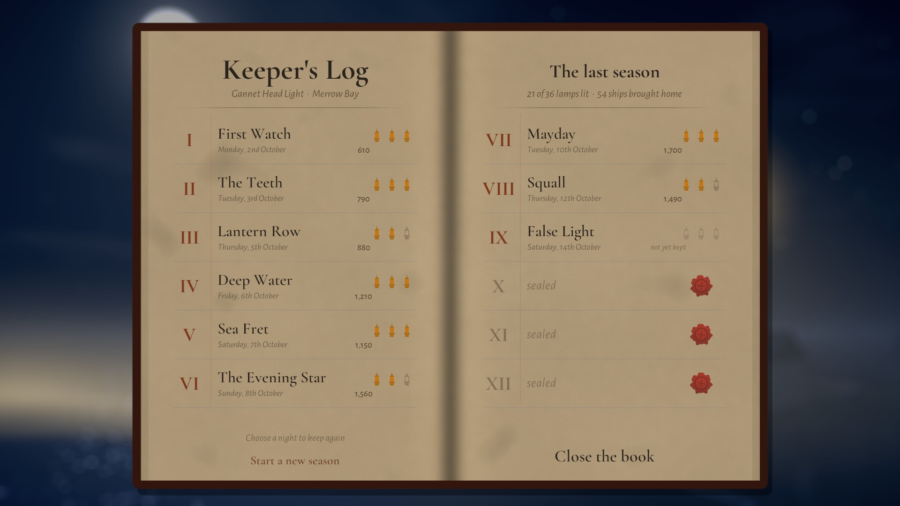

Dawn tallies every night with up to three lamps and a short debrief of every ship that had a bad
night: which reef it struck and whether that reef was uncharted or charted too late, who was lured
and by which false light, and who lost their way. The keeper's logbook keeps your best for each
night so you can go back for a cleaner watch. Finish the season and the **Night Watch** opens: an
endless score attack with every reef, sandbank and buoy out and no end to the ships. Each watch
brings its own weather: one to three fog banks in different places, squalls that blow through
every few minutes with current, rain and lightning (stronger as the night wears on), and wreckers
lighting up at their own times, with the mimic light late in a long watch. Ianto gives the forecast
in the briefing, and the logbook of the watch keeps your five best.

## Content overview

One coast (Merrow Bay), three hulls and twelve nights. Each night introduces one idea through
night 9, and the later nights combine them:

| Night | Name | What's new |
|---|---|---|
| I | First Watch | Aiming: ships follow the light |
| II | The Teeth | Hidden reefs and charting, and focus for reach |
| III | Lantern Row | Buoys |
| IV | Deep Water | Collier steamers and the Long Sands shoal |
| V | Sea Fret | Fog banks and the foghorn |
| VI | The Evening Star | The passenger ferry |
| VII | Mayday | Damaged vessels without lights |
| VIII | Squall | Storm current, rain and lightning |
| IX | False Light | Wreckers |
| X | Two Lights | Wreckers moving between sites, in fog |
| XI | The Mimic | A false light that copies your sweep |
| XII | Last Light | The finale |
| ∞ | Night Watch | Unlocked after the season: endless, with every hazard out and its own fog, squalls and wreckers each time; the third wreck ends the watch |

| Hull | Character |
|---|---|
| Trawler | Small and quick, turns tightly, loses confidence fast |
| Collier steamer | Big and slow, turns wide, runs aground on sandbanks that trawlers sail over |
| Passenger ferry | Rows of lit windows, and worth the most |

Around the nights you'll find a live title scene, briefing cards, the radio, pause and settings
menus, dawn results, an ending, and credits that name every ship you brought home. Progress and
settings are saved locally.

## Screenshots

| | |
|---|---|
| 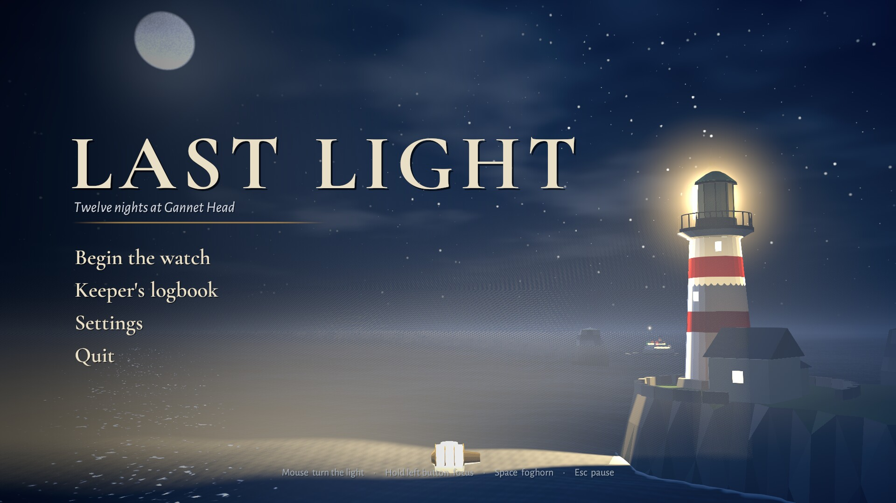 |  |
|  |  |
|  | 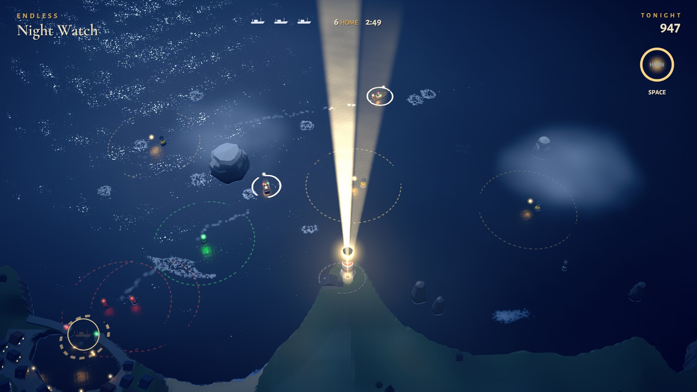 |
|  |  |
|  |  |

## Play it

1. Download `LastLight-v0.1.0-linux-x86_64.zip` from the
   [latest release](https://github.com/nearbycoder/LastLight/releases/latest).
2. Unzip it and run `./LastLight.sh`, or run `./LastLight.x86_64` directly.

You'll need 64-bit Linux and a GPU with OpenGL 4.5. The game was developed on CachyOS (Arch) with
an AMD Radeon integrated GPU under Wayland. On Wayland, `LastLight.sh` starts Unity's native
Wayland backend, because the X11/XWayland path hung at startup on the development machine.
There's no published Windows or macOS build yet. A macOS build can be made from source (see below),
but it's unsigned and hasn't been run on a Mac.

## Build from source

**Requirements:** Unity **6000.6.2f1** (URP 17.6, Input System 1.20; the packages resolve from
`Packages/manifest.json`), **Blender 4.5 LTS** for the models, Python 3 with the packages in
`Tools/requirements.txt` for audio and tooling, and FFmpeg for captures and the trailer.

```sh
python3 -m venv Tools/.venv && Tools/.venv/bin/pip install -r Tools/requirements.txt

# Data: the map and the missions (JSON, the single source of truth for positions)
python3 ArtSource/map/merrow_bay.py
python3 ArtSource/map/missions.py
Tools/.venv/bin/python Tools/chart.py                    # a top-down chart PNG for review

# Models: FBX into Assets/Resources/Models, preview renders into ArtSource/_renders
blender -b --threads 4 -P ArtSource/blender/build_assets.py -- --preview
blender -b --threads 4 -P ArtSource/blender/build_assets.py -- steamer lighthouse   # just some

# Audio: effects, radio voices and music, synthesized to Assets/Resources/Audio
Tools/.venv/bin/python ArtSource/audio/build_audio.py
Tools/.venv/bin/python ArtSource/audio/build_audio.py music                        # just the music

# Unity
Tools/unity.sh                 # open the editor
Tools/unity.sh build-linux     # batch-build Builds/Linux/LastLight.x86_64
Tools/unity.sh build-mac       # batch-build Builds/Mac/LastLight.app (universal Intel + Apple Silicon)
Tools/unity.sh build-windows   # batch-build Builds/Windows/LastLight.exe (needs the Windows module)
Tools/play.sh                  # run the build (LL_W=1920 LL_H=1080 for a window size)
Tools/package.sh 0.1.0 linux   # zip a build for a release, into Builds/release (or mac, windows)
```

`Tools/unity.sh` expects the editor at `~/Unity/Hub/Editor/6000.6.2f1` (set `UNITY` to change
that). On Arch-based distributions the editor needs the legacy `libxml2.so.2`
(`sudo pacman -S libxml2-legacy`). Alternatively, set `LASTLIGHT_UNITY_LIBS` to a folder that
contains a copy of it.

### Tests and validation

- `Tools/unity.sh test` runs the EditMode tests (55 of them). They check that every mission
  references valid map data, that every reef, buoy and wrecker lantern is reachable by the beam,
  that every route is safe for every hull once its hazards are charted, that the **AutoKeeper**
  bot wins all twelve nights in the pure simulation, that the bot keeps a generated Night
  Watch for at least ten minutes, and that the dawn debrief accounts for every wreck when the
  bot is made to neglect each ship in turn. Two more stage a steamer at Widow's Ledge. One checks
  that the crew warn of breakers a few seconds before an uncharted strike. The other charts the
  reef at distances from 2 to 44 units, with and without full astern, and checks that full astern
  turns some late charts into near misses and never causes a wreck. Others check that ten Night
  Watch seeds give ten different nights and that a squall eases in and out. On difficulty, they
  check that the AutoKeeper wins all twelve nights on Hard, that its Standard scores match the
  tuned game exactly, and that Hard really is harder: shorter charts and buoys, no warning, closer
  watch ships.
- `Tools/validate.sh` prints the same checks as a report from a resident editor
  (`Tools/unity.sh serve`). `Tools/tour.sh report <dir>` produces the report from the built player.
  The report also plays every night with a **novice keeper**, which is slow to react, has a shaky
  hand and doesn't know where the reefs are.
- The latest report, from the current build: the AutoKeeper wins all twelve nights with three lamps
  each. The novice wins every night in three runs each, with lamps of 9, 9, 8, 8, 8, 7, 6, 9, 7,
  9, 6 and 7 out of 9 (93 of 108) and no wrecks. The bot keeps every generated Night Watch for the
  full 30 minutes the report runs, with no wrecks, and so does the novice, with 1 or 2 wrecks,
  even with the squalls. On **Hard** the AutoKeeper still wins all twelve nights (two lamps on night
  6, three on the rest), and the novice drops to 74 of 108 lamps with 7 wrecks, close to v0.1.0's
  78 and 9. On Hard the bot keeps two of three watches for 30 minutes, and the novice's watches end
  after 24 to 28 minutes. For comparison, v0.1.0 gave the AutoKeeper
  one lamp on night 9, gave the novice 78 of 108 lamps (3/9 on nights 7 and 8) with 9 wrecks, and
  the bot's watches ended after 16 to 25 minutes. Nearly all of those wrecks were hulls striking
  reefs that had already been charted, and full astern now prevents those (see Status and known
  issues).
- `Tools/tour.sh <ui|nights|ending|input|watch|flash|breakers> <dir> -llFresh` plays the built
  game with scripted input and saves screenshots. `-llFresh` keeps the tour away from your save.
  The `ui` tour ends on two staged dawn debriefs. The `input` tour drives the real mouse and
  keyboard path, then a simulated gamepad (menus, aim, focus, horn and pause). It also checks that
  prompts follow the device, that a hint seen once stays away, that losing focus or unplugging the
  pad pauses the night, and that the d-pad walks both settings columns. `flash` measures screen
  brightness on a lightning strike with Reduce flashing off and on. `breakers` captures a breakers
  warning and a full-astern call. `-llRenderScale 70` and `-llReduceFlashing` set those options
  for any tour. No real gamepad has been tested, only Unity's simulated device.
- `Tools/.venv/bin/python Tools/cvd_sim.py OUT.jpg "Label=shot.png:x,y,w,h" ...` shows screenshot crops
  as seen with deuteranopia and protanopia (Machado 2009), for checking that states read without
  colour. `Tools/tour.sh status` captures a lost ship and a lured ship for it.
- `Tools/.venv/bin/python Tools/audio_check.py` measures every synthesized clip: clipping, true
  peak, EBU R128 loudness, DC offset, clicks, and the seams of looped clips.
- `Tools/record.sh` records a four-minute gameplay reel with sound.

### The trailer

`Tools/make_trailer.sh` rebuilds everything in `docs/media` from the built game. The `trailer`
tour (`Assets/Scripts/Automation/Trailer.cs`) plays each shot as a scripted night. The AutoKeeper
does the playing, with a little staging: a neglected trawler, a forced foghorn, a held focus. The
simulation is deterministic, so a headless twin of each night runs first to find the frame where
the moment happens. The real night is then fast-forwarded off camera and recorded at a fixed 30
fps, with the game's audio mix and music muted. `Tools/make_trailer.py` cuts the clips to the bars
of the title waltz, which it re-synthesizes from the game's own music generator. It also animates
the captions in the game's fonts, ducks the music under the game's sound, normalizes to −16 LUFS
and encodes the trailer, the poster and the teaser loop. `Tools/make_trailer.sh --edit` re-edits
an existing shoot.

## Project structure

```
Assets/
  Scripts/Sim/         Pure C# simulation: map, beam, ships, reefs, buoys, fog, wreckers, storm,
                       scoring, the Night Watch generator, the AutoKeeper bot, content validation
  Scripts/View/        World, ship and effect views, camera rig, materials, model loading
  Scripts/Core/        Game flow, mission runner, input, radio, save data, the ending
  Scripts/UI/          HUD and menu screens, built in code
  Scripts/Audio/       Pooled SFX buses and the layered music director
  Scripts/Automation/  Screenshot tours, the gameplay recorder and the trailer shoot
  Shaders/             Water, volumetric atmosphere, sky, lit props, glows, rings, reef foam
  Resources/Data/      merrow_bay.json (the map) and missions.json (the twelve nights)
  Resources/Models/    FBX exported from Blender
  Resources/Audio/     Synthesized OGG effects, voices and music
  Resources/Fonts/     Cormorant Garamond, Alegreya Sans, Special Elite, with their licenses
  Editor/              Project setup, build script, import settings
  Tests/EditMode/      Content proofs (see Tests and validation)
ArtSource/
  blender/             bpy model generators (build_assets.py is the entry point) and .blend scenes
  audio/               numpy/scipy synthesis of effects, voices and music
  map/                 merrow_bay.py and missions.py, which write the JSON data
Tools/                 Editor, build, play, tour, validation, chart, audio-check and trailer scripts
docs/                  BRIEF.md (the original brief), PLAN.md (the design and technical plan), media/
```

## Tech highlights

- **A simulation you can prove things about.** All gameplay lives in a pure C# `SimWorld`,
  stepped at a fixed 60 Hz with a seeded RNG. The view layer only reads it and interpolates. The
  same code runs in the game, in the EditMode tests and under the AutoKeeper bot, which plays
  through the same input struct as a player, so the lens's speed limits apply to it too.
- **What looks lit is lit.** The beam test (cone falloff, range, the shadows of sea stacks and fog
  extinction) is written once in C# and mirrored in HLSL (`LLCommon.hlsl`). The glow you see on
  the water is the same function the ships respond to.
- **Volumetric night.** A full-screen raymarch (`Atmosphere.shader`) computes single scattering
  from the beam analytically per sample, together with moonlit haze and drifting fog banks. The
  fog quality setting is the step count. Water uses Gerstner waves, a moon glitter path, and a foam
  texture the simulation writes for charted reefs and wakes.
- **One source of truth for the coast.** `merrow_bay.json` drives the simulation and Blender's
  generators for the cliffs, rocks and buoys, so geometry and gameplay can't drift apart. The
  generators can render a preview of each model for review (`--preview`).
- **Synthesized sound.** Radio voices are formant-synthesis gibberish, pitched and timed per
  character and band-passed like a wireless. The score (a waltz, a night bed with a tension layer
  that rises as ships get lost, dawn, and a music-box ending) comes from the same Python
  generators, and a measurement pass guards against clicks, loop seams and loudness drift.
- **Balance by bot.** The AutoKeeper wins every night, and a deliberately sloppy novice model gives
  a rough difficulty curve across the season.

## Credits and tooling

Made by [nearbycoder](https://github.com/nearbycoder). The original brief and the full design
plan are in [`docs/BRIEF.md`](docs/BRIEF.md) and [`docs/PLAN.md`](docs/PLAN.md).

- **Engine:** Unity 6000.6.2f1 with the Universal Render Pipeline and the Input System.
- **Models:** generated with Blender 4.5's Python API (`ArtSource/blender`).
- **Sound and music:** synthesized with numpy and scipy (`ArtSource/audio`).
- **Fonts:** [Cormorant Garamond](https://github.com/CatharsisFonts/Cormorant) and
  [Alegreya Sans](https://github.com/huertatipografica/Alegreya-Sans) under the SIL Open Font
  License 1.1, and Special Elite by Astigmatic under the Apache License 2.0.
- **Trailer and captures:** FFmpeg, numpy and Pillow.

See [`THIRD_PARTY_NOTICES.md`](THIRD_PARTY_NOTICES.md) for the full list of third-party
components and their licenses.

## Status and known issues

Version 0.1.0 is the complete first version: twelve nights, the ending and the Night Watch, on
Linux. Here's what is still unproven or rough:

- **Not yet playtested by a person.** Balance comes from the AutoKeeper and the novice model, and
  feel was judged from screenshots, video and scripted input. Drain rates, ship schedules and the
  Night Watch's ramp may need tuning once people play it.
- **The audio has only been measured.** Every clip passes `Tools/audio_check.py`, but no one has
  yet judged whether the music and gibberish voices are pleasant to listen to.
- **Gamepad support is tested only with a simulated device.** Button layouts and stick dead zones
  on real controllers are unverified.
- **Linux only, as published.** `Tools/unity.sh build-mac` makes a universal macOS app (Mono, macOS
  12 or later) and `Tools/package.sh <version> mac` zips it with instructions for opening an
  unsigned app. The build succeeds on Linux, and both architectures of the executable carry
  Unity's ad-hoc signature, but it isn't signed with a Developer ID or notarized, and **it has
  never been run on a Mac**. Signing needs an Apple Developer account. `build-windows` is ready
  but needs Unity's *Windows Build Support (Mono)* module, which isn't installed on the
  development machine; without it the command stops with a clear message. There's no web build.
- **Balance shifted after v0.1.0, and that shift hasn't been tested by people.** The wrecks that ended
  the bot's Night Watches turned out not to be late charts. Steamers and ferries threading Widow's
  Ledge struck reefs that had been charted well ahead, because their avoidance couldn't make the
  turn. Captains now ring for full astern when a charted reef or sandbank is closer than they can
  turn away from, so the wrecks left are uncharted rocks, lost ships and lured ships. The bot and
  the novice model now rarely or never wreck (see the latest report under Tests and validation),
  so the season and the Night Watch may now be too forgiving for strong players. The report shows
  even the novice keeping a Night Watch for 30 minutes. **Hard** (Settings ▸ Difficulty) is the
  tougher choice. It leaves Standard exactly as it was, and a test pins the AutoKeeper's Standard
  scores on all twelve nights. If that's the
  case, tighten them with deliberate levers (drain rates, schedules, the Night Watch's ramp)
  rather than steering faults.
- Fog nights on the High quality setting can drop below 60 fps on weaker GPUs. Medium, or a
  render scale of 70%, is the safer choice there. On the development machine's Radeon 8060S at
  1600×900, night 5 averaged about 50 fps at 100% and about 74 fps at 70%. Those runs were made
  while the machine was heavily loaded by other work, so treat the numbers as rough.
- On the development machine, the X11/XWayland window path hung at startup. Use `LastLight.sh`
  under Wayland.
- **No license has been chosen yet.** Until one is added, all rights are reserved. The bundled
  fonts keep their own open licenses.
