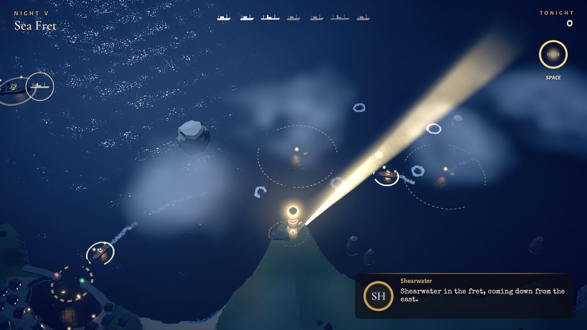
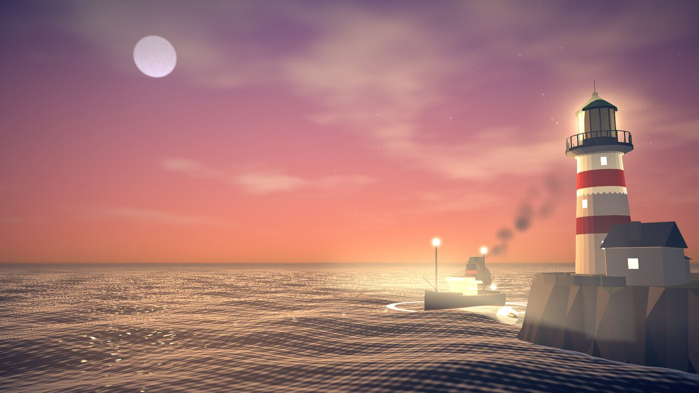

# Last Light

> You keep the last lighthouse on a wrecking coast. Sweep its beam through the night to guide
> ships home, chart the hidden reefs ahead of them, and expose the false lights trying to lure
> them in.

Gannet Head Light is being decommissioned at the end of the season. You have twelve nights left.


| | |
|---|---|
|  |  |
|  |  |

Built in Unity 6000.6.2f1 (URP). Every model is scripted in Blender 4.5, and every sound and
note of music is synthesized in Python. There are no stock or sampled assets.

## Playing

```sh
Tools/play.sh                 # runs Builds/Linux/LastLight.x86_64
LL_W=1920 LL_H=1080 Tools/play.sh
```

The game starts fullscreen. Settings → Display switches to a window, which uses the size
`play.sh` passes (1600×900 unless `LL_W` and `LL_H` are set). `play.sh` uses Unity's native
Wayland backend when a Wayland session is present, because the X11/XWayland path hangs at
startup on this machine. The binary can also be run directly.

### Controls

| Input | Action |
|---|---|
| Mouse | Aim the beam. The lens follows with weight, so fast swings lag a little |
| Hold left mouse, Shift or W | Focus: a narrow, long, powerful beam that turns slower |
| Space or right mouse | Foghorn (14 s cooldown) |
| A / D or ← / → | Turn the lens directly from the keyboard |
| Esc or P | Pause, or back out of a menu |
| Gamepad | Right or left stick aims, either trigger focuses, A sounds the foghorn, Start pauses |

## Rules

- **Ships follow the light.** Each ship has a confidence ring. In your beam it refills, and in
  the dark it drains. At zero the captain is **Lost**: the ship slows, wanders and drifts toward
  the shore until you light it again.
- **Reefs are hidden.** Captains' routes run straight over rocks they don't know about. Light a
  reef briefly to **chart** it: white water breaks over it and captains steer around it. Charts
  fade after about 22 s without light, so chart ahead of each ship at the right moment.
  Steamers turn wide and need warning early; trawlers can dodge late.
- **Buoys** charge when the beam sweeps them. A burning buoy keeps nearby ships confident for
  about 28 s, which covers a channel while you tend to others or reach into the shadows that
  tall rocks cast.
- **Fog** drains ships faster and swallows the wide beam. Focus cuts through it, and the
  foghorn gives every ship in earshot a boost of confidence.
- **Damaged vessels** have no lights. Find them from their radio bearing and their distress
  flares.
- **Storms** push ships with a current and cut the beam's range. Lightning briefly charts every
  reef in the bay.
- **False lights**: wreckers on the cliffs sweep a lantern that imitates yours. A ship caught
  in it while you're elsewhere is **Lured** onto the rocks. Hold your beam on the lantern to
  douse it, or light the ship to break the spell.

A night ends when every scheduled ship has made port or been lost. It fails immediately if
wrecks exceed that night's allowance. Lamps (stars) are earned for surviving the night, for no
wrecks, and for a **steady hand** (no ship ever Lost or Lured).

## Content

One coastal map (Merrow Bay), three vessel types and twelve nights. Each night introduces one
idea, and the later nights combine them:

| # | Night | New element |
|---|---|---|
| 1 | First Watch | Aiming: ships follow the light |
| 2 | The Teeth | Hidden reefs and charting, and focus for reach |
| 3 | Lantern Row | Buoys |
| 4 | Deep Water | Collier steamers and the Long Sands shoal |
| 5 | Sea Fret | Fog banks and the foghorn |
| 6 | The Evening Star | The passenger ferry |
| 7 | Mayday | Damaged vessels without lights |
| 8 | Squall | Storm current, rain and lightning |
| 9 | False Light | Wreckers |
| 10 | Two Lights | Wreckers moving between sites, with fog |
| 11 | The Mimic | A false light that copies your sweep |
| 12 | Last Light | The finale, then dawn and the ending |

| Vessel | Character |
|---|---|
| Trawler | Small and quick, turns tightly, loses confidence fast |
| Collier steamer | Big and slow, turns wide, runs aground on shoals |
| Passenger ferry | Rows of lit windows, worth the most |

Around the nights: a live title scene, a keeper's logbook for night select with best lamps and
scores, briefing cards, a HUD with a ship manifest and radio panel, pause, settings, dawn
results, and an ending sequence with credits that name the ships you brought home. Captains and
the harbourmaster speak on the radio with typed text and synthesized gibberish voices. Progress
and settings are saved in PlayerPrefs.

Settings: master, music, effects, radio and ambience volumes, text speed, fog and haze quality
(volumetric step count), screen shake, hints, and windowed or fullscreen.

## Project layout

```
Assets/
  Scripts/Sim/         Pure C# simulation: map, beam, ships, reefs, buoys, fog, wreckers,
                       storm, scoring, the AutoKeeper bot, content validation
  Scripts/View/        World, ship and effect views, camera rig, materials, model loading
  Scripts/Core/        Game state machine, mission runner, input, radio, save data, ending
  Scripts/UI/          HUD and menu screens, built in code
  Scripts/Audio/       Pooled SFX buses and the layered music director
  Scripts/Automation/  Screenshot tours driven from the command line
  Shaders/             Water, volumetric atmosphere, sky, lit props, glows, rings, reef foam
  Resources/Data/      merrow_bay.json (the map) and missions.json (the twelve nights)
  Resources/Models/    FBX exported from Blender
  Resources/Audio/     Synthesized OGG effects, voices and music
  Editor/              Project setup, build script, import settings
  Tests/EditMode/      Content proofs (see Validation)
ArtSource/
  blender/             bpy model generators (build_assets.py is the entry point)
  audio/               numpy/scipy synthesis of effects, voices and music
  map/                 merrow_bay.py and missions.py, which write the JSON data
  *.blend              Saved Blender scenes for each asset
Tools/                 Editor, build, play, tour, validation and chart scripts
docs/                  BRIEF.md, PLAN.md (the full design and technical plan), media/
```

The simulation is deterministic and doesn't depend on rendering, so the same code runs in the
game, in the EditMode tests and in the bot. The map JSON is the single source of truth for
positions: Unity's simulation and Blender's coast, rocks and buoys are all generated from it.

## Rebuilding

The Unity editor on this machine needs a legacy `libxml2.so.2`. `Tools/unity.sh` points the
loader at a local copy; the proper fix is `sudo pacman -S libxml2-legacy`.

```sh
# Data: map and missions JSON
python3 ArtSource/map/merrow_bay.py
python3 ArtSource/map/missions.py
Tools/.venv/bin/python Tools/chart.py               # top-down chart PNG for review

# Models: FBX into Assets/Resources/Models, previews into ArtSource/_renders
blender -b --threads 4 -P ArtSource/blender/build_assets.py -- --preview
blender -b --threads 4 -P ArtSource/blender/build_assets.py -- steamer lighthouse

# Audio: needs a venv with numpy and scipy (python3 -m venv Tools/.venv)
Tools/.venv/bin/python ArtSource/audio/build_audio.py          # sfx, voices and music
Tools/.venv/bin/python ArtSource/audio/build_audio.py music

# Unity
Tools/unity.sh                 # open the editor
Tools/unity.sh setup           # apply render pipeline and project settings (batch)
Tools/unity.sh build-linux     # build Builds/Linux/LastLight.x86_64 (batch)
Tools/unity.sh serve &         # or keep a resident batch editor, then:
Tools/build.sh                 # build through the resident editor
```

## Validation

- `Tools/unity.sh test` runs the EditMode tests. `Tools/validate.sh` runs the same checks in a
  resident editor and prints a report. The checks are:
  - every mission references valid routes, entries and buoys;
  - every reef, buoy and wrecker site is reachable by the beam;
  - every route is safe for every hull that sails it once its hazards are charted (42
    route and hull pairs);
  - the AutoKeeper bot wins every night in the pure simulation.
- The latest report: the bot wins all twelve nights. It earns three lamps on ten of them, two
  on nights 11 and 12, and one on night 9, where it loses a ship to the wreckers. That's the
  intended difficulty: the wrecker nights are the hardest.
- `Tools/tour.sh <ui|nights|ending|input> <outdir>` plays the built game with scripted input,
  saves screenshots and reports any console errors and frame times. The `input` tour drives the
  real mouse and keyboard path in the player.
- `Tools/record.sh [out.mp4]` records a four-minute gameplay reel with sound (the title, five
  nights played by the bot, the results and the ending) to `Builds/LastLight_gameplay.mp4`.
  Time is stepped at a fixed 30 fps, so the video is smooth however busy the GPU is.
- `Tools/burst.sh <night> '<condition>' <frames> <gap> <name>` plays a night in the resident
  editor until a C# condition over the world holds, then captures a run of frames. For example,
  `LL_EXTRA="-llNeglect 0" Tools/burst.sh 5 'w.Wrecks > 0' 6 0.5 wreck` has the bot ignore the
  first ship so that it strikes a reef, and captures the wreck.

## Performance

Measured in the player at 1920×1080 on this machine's Radeon iGPU, which was shared with
several other running games and editors:

- Clear and storm nights: about 140 to 155 fps uncapped.
- Fog nights (5, 7 and 10) on High: about 60 to 70 fps. Medium is about 90 fps and Low about
  135 fps. The fog raymarch is the main cost.

The frame rate is paced with `targetFrameRate` at the monitor's refresh rate rather than vsync,
because this compositor throttled vsync'd presentation to about 12 fps when the window wasn't
in front.

## Known gaps

- **Not playtested by a human.** Balance comes from the bot's reports, and feel was judged
  from screenshots and scripted input. Expect the drain rates and ship schedules to need tuning.
- **Gamepad support is untested.** It's implemented through the Input System, but no gamepad
  was connected during development.
- **Night Watch,** the endless mode planned as a stretch goal in `docs/PLAN.md`, isn't built.
- The settings screen has no resolution picker or beam-sensitivity slider, which the plan
  listed. Fullscreen uses the desktop resolution, and windowed mode uses the size passed on
  the command line.
- Fog nights on High may dip below 60 fps on weaker GPUs. Medium is the safer choice there.
